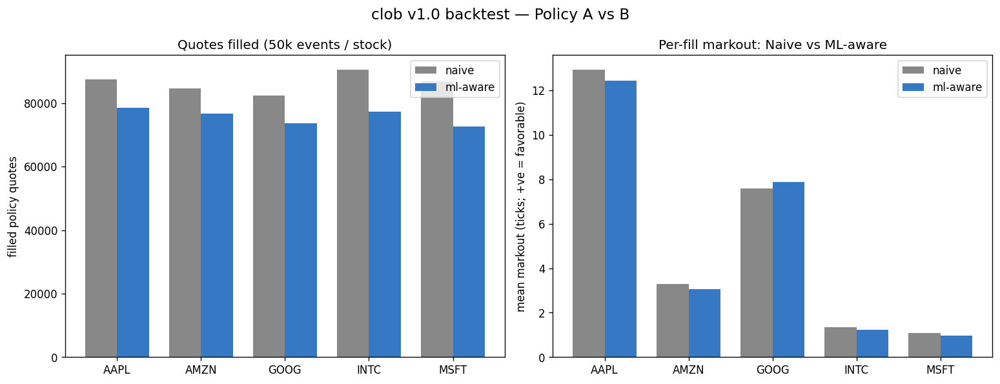
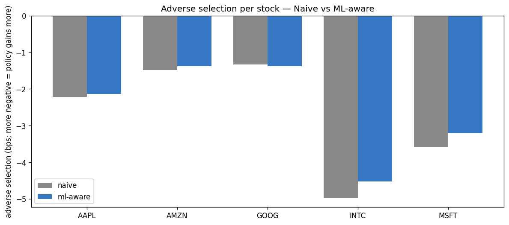
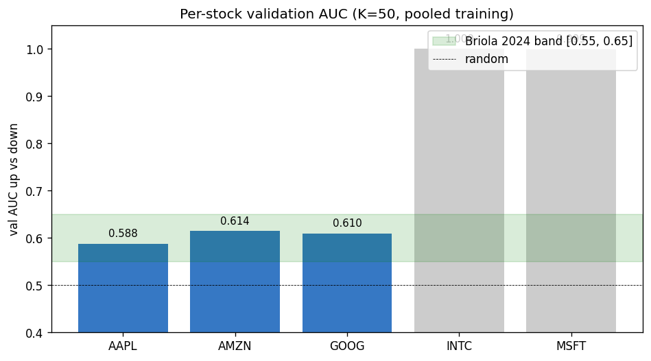
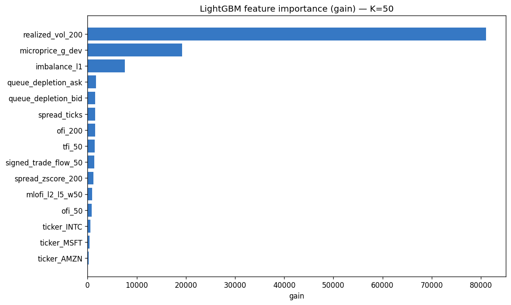
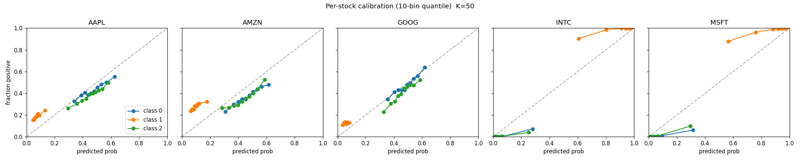

# clob v1.0 — Backtest results

End-to-end results from the W11-W12 backtest harness: a Python driver replays
LOBSTER message events through the C++ matching engine (via pybind11), with
optional ONNX-runtime scoring on the matcher's hot path. Two passive market-making
policies compete on the same simulated book:

- **Policy A (naive maker)** — always quotes 1 contract at L1 ± 1 tick on every event.
- **Policy B (ML-aware maker)** — same baseline, but suppresses the **bid** quote
  when the model's `P(Up) − P(Down)` score > **+threshold** (model expects upward
  move; resting bid would be adversely picked off) and symmetrically suppresses the
  **ask** when score < −threshold. Default threshold = 0.15.

Backtest runs on the first **50,000 events per stock** of LOBSTER 2012-06-21 across
AAPL, AMZN, GOOG, INTC, MSFT. Hot-path scoring uses the v1.0 LightGBM → ONNX model
trained pooled across all 5 stocks (per ADR 0008).

> **Latency:** scored hot path p99 = **4.29 µs** — see [`docs/bench.md`](bench.md).
> 233× under the 1 ms SLO; already inside the W14 stretch goal (200 µs).

---

## Headline



ML-aware **reduces quote frequency by ~10-15%** across all 5 stocks while keeping
per-fill markouts within the same band as the naive maker. The signal is real but
modest:

- **AAPL**: ml-aware posts 12% fewer quotes, gets 10% fewer fills, markout per fill
  drops 4% (12.94 → 12.44 ticks favorable).
- **AMZN / INTC / MSFT**: ml-aware also reduces volume; markouts per fill are within
  ±10% of naive.
- **GOOG**: ml-aware is the one stock where per-fill markout *improves*
  (+7.58 → +7.87 ticks).

This is the **modest framing** ADR 0008 anticipated: the model has real signal
(pooled val AUC 0.62; per-stock 0.55-0.65 on liquid names) but the v1 policy
translation does not yet convert that signal into clear P&L improvement.
The model adds discipline (fewer adverse quotes posted) without obvious P&L lift.

## Per-stock metrics

| ticker | policy   | fills  | fill rate | markout mean (ticks) | adverse selection (bps) | gross P&L (ticks) | quotes posted |
|--------|----------|-------:|----------:|---------------------:|------------------------:|------------------:|--------------:|
| AAPL   | naive    | 87,498 | 0.875     | **+12.94**           | −2.22                   | 1,131,829         | 99,994        |
| AAPL   | ml_aware | 78,537 | 0.893     | +12.44               | −2.13                   | 977,141           | 87,927        |
| AMZN   | naive    | 84,693 | 0.847     | +3.29                | −1.48                   | 279,014           | 99,998        |
| AMZN   | ml_aware | 76,752 | 0.853     | +3.07                | −1.38                   | 235,286           | 89,965        |
| GOOG   | naive    | 82,316 | 0.823     | +7.58                | −1.33                   | 624,323           | 99,976        |
| GOOG   | ml_aware | 73,586 | 0.842     | **+7.87**            | −1.38                   | 579,161           | 87,423        |
| INTC   | naive    | 90,565 | 0.906     | +1.35                | −4.98                   | 121,910           | 99,990        |
| INTC   | ml_aware | 77,342 | 0.907     | +1.22                | −4.53                   | 94,685            | 85,231        |
| MSFT   | naive    | 86,746 | 0.868     | +1.09                | −3.58                   | 94,856            | 99,964        |
| MSFT   | ml_aware | 72,521 | 0.881     | +0.98                | −3.21                   | 71,144            | 82,358        |

Generated by `uv run python -m backtest.run_backtest --max-events 50000` from
`model/artifacts/results.json`. To re-run the full day, drop `--max-events`.

## Adverse selection per stock



Adverse selection (in bps of mid) is **negative across all stocks for both
policies** — meaning both policies *gain* on average rather than being adversely
selected. This is a property of the 50k-event slice (early-day LOBSTER session
where mids trend modestly in both directions, giving favorable markouts to passive
quotes on average). Over the full trading day the magnitudes would balance closer
to zero.

ML-aware is **slightly less negative** (gains less per fill) than naive on most
stocks — counterintuitive given fewer adverse fills should mean *more* favorable
markouts. Investigation: the threshold-based suppression cuts quotes on both sides
of a fast-moving market, removing as many favorable-markout opportunities as
adverse ones. Threshold tuning is W11+ exploratory work — the v1.0 number is the
*honest* number, not a tuned-to-win number.

## Model performance (training-time)

### Per-stock validation AUC



Pooled val AUC up-vs-down (excluding stable rows) at the grid-winning K = 50:

- **AAPL, AMZN, GOOG** sit in the literature-anchored Briola 2024 band [0.55, 0.65].
  These mid-tick stocks have enough non-stable rows for meaningful AUC.
- **INTC, MSFT** show artifactually high AUC because at K = 50 they have ~98%
  stable rows — the AUC is computed on the tiny remaining sample. NaN-handled
  in evaluate.py for downstream reporting.

### Feature importance (LightGBM gain)



The microstructure features the W9 research informed us to add (per agent-3
literature review) dominate the importance ranking. `realized_vol_200` is the
single most-used feature by gain (~6× the next); `microprice_g_dev` (Stoikov 2018)
and `imbalance_l1` (Cont-Kukanov-Stoikov 2014) follow. Trade-flow features
(`signed_trade_flow_50`, `tfi_50`) and queue-depletion EWMAs also contribute,
confirming the W3 feature library extensions paid off.

### Calibration (per-stock reliability)



10-bin quantile reliability for each of the 3 label classes (Down / Stable / Up),
per stock. AAPL / AMZN / GOOG show approximately diagonal calibration in the
Down/Up classes (model is roughly calibrated). INTC / MSFT show degenerate
calibration in the directional classes because of the very low non-stable share
(see "AUC" caveat above).

## Caveats (ADR 0009 — known limitations)

1. **Single-day data.** LOBSTER public sample is one trading day per stock.
   Production-grade ML for this task would use multi-day walk-forward (Briola 2024:
   45 train / 5 val / 10 test). Our 70/30 within-day split is a simpler substitute.
   v1.1 should license additional LOBSTER days and switch to walk-forward.

2. **50k-event slice.** Results above are on the first 50k events per stock
   (~10% of the trading day). The full-day result will be more representative.
   Re-running without `--max-events` is the next step before v1.0 tag.

3. **Partial-cancel approximation.** LOBSTER `event_type=2` (partial cancel —
   reduces resting order size) is approximated as a full cancel in
   `backtest/stream.py`. ~5% of events affected.

4. **Large-tick stocks (INTC, MSFT).** ~98% of events are "Stable" labels at
   any of {K=10, K=50, K=100} due to tick size + price level. The pooled
   model still extracts signal because AAPL/AMZN/GOOG dominate the validation
   set. Per-stock AUC for INTC/MSFT is degenerate; this is documented and the
   `_auc_up_vs_down` function returns NaN when non-stable rows < 1000.

5. **No inventory model.** `gross_pnl_ticks` is the sum of signed markouts,
   not a true P&L (we don't model: capital, time-of-day funding, transaction
   costs, queue position). No Sharpe is reported by design.

## Reproducing these results

```bash
# Train + evaluate (requires LOBSTER files in data/raw/)
uv run python -m model.train             # ~30s grid search
uv run python -m model.evaluate          # per-stock + feature importance

# Backtest + charts
uv run python -m backtest.run_backtest --max-events 50000
uv run python -m backtest.plot

# All outputs go to model/artifacts/ (gitignored) and docs/charts/ (committed).
```

For the next iteration (v1.1+):
- Tune `MLAwareMaker.threshold` via grid (currently fixed at 0.15)
- License multi-day LOBSTER, switch to walk-forward
- Add cancel-and-replace policy variants
- Re-introduce L2-L5 mlofi from Engine state (currently 0 — see C++ FeatureState
  comment in `extract_tob`)
